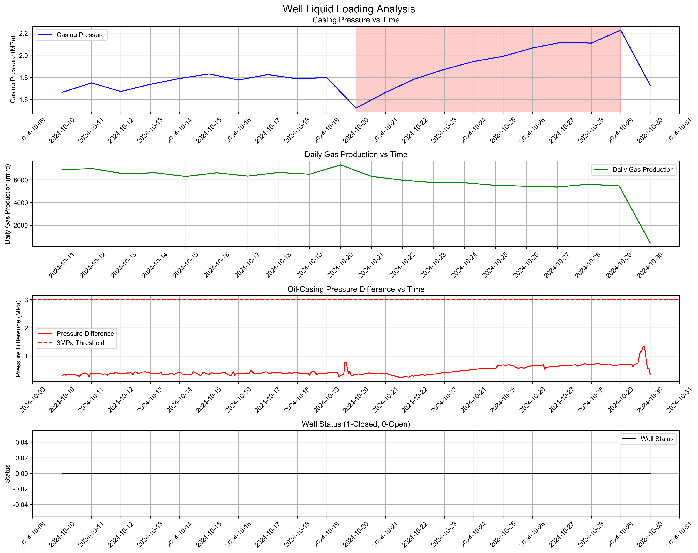

# 气井积液分析服务

## 项目结构 
```
liquid_loading/            # 项目根目录
├── src/                   # 源代码目录
│   ├── api.py             # API接口定义
│   ├── config.py          # 配置管理
│   ├── data_loader.py     # 数据加载
│   ├── process.py         # 处理逻辑
│   └── utils.py           # 工具函数
├── data/                  # 数据目录
│   ├── input/             # 输入数据
│   └── output/            # 输出结果
├── config/                # 配置文件目录
│   └── config.yaml        # 配置文件
├── docker/                # Docker相关文件
│   ├── Dockerfile         # 构建文件
│   ├── .dockerignore      # Docker忽略文件
│   └── docker-compose.yml  # 服务编排
├── requirements.txt       # 项目依赖
├── main.py                # 应用入口
└── README.md              # 项目说明
```

## 快速开始

### 1. 启动服务
```bash
# 进入docker目录
cd docker

# 构建并启动服务
docker-compose up --build

# 后台运行
docker-compose up -d --build
```

### 2. 修改端口
如果需要修改服务端口（默认7999），需要修改以下三个文件：

1. `main.py`:
```python
def main():
    uvicorn.run(
        "api:app", 
        host="0.0.0.0",
        port=7999,  # 修改此处
        reload=True
    )
```

2. `docker/Dockerfile`:
```dockerfile
# 暴露端口
EXPOSE 7999  # 修改此处
```

3. `docker/docker-compose.yml`:
```yaml
ports:
  - "7999:7999"  # 修改此处
healthcheck:
  test: ["CMD", "curl", "-f", "http://localhost:7999/health"]  # 修改此处
```

修改后需要重新构建并启动服务：
```bash
docker-compose up --build
```

### 3. 关闭服务

```bash
# 在docker目录下执行
docker-compose down

# 或者在项目根目录执行
docker-compose -f docker/docker-compose.yml down
```

## 健康检查
可以通过访问以下地址检查服务状态：
```
http://localhost:7999/health
```

## API文档
启动服务后，可以通过以下地址访问API文档：
```
http://localhost:7999/docs
```

## API 文档

### 分析接口

#### 请求信息
- URL: `/analyze`
- 方法: `POST`
- Content-Type: `application/json`

#### 请求参数
```json
{
    "data_source": {
        "time": ["2024-10-29 00:00:00", "2024-10-29 01:00:00", ...],
        "oil_pressure": [1.431, 1.425, ...],
        "casing_pressure": [2.129, 2.128, ...],
        "tubing_pressure": [1.444, 1.439, ...],
        "gas_flow_rate": [218.986, 223.815, ...],
        "total_gas_flow": [3390283, 3390508, ...],
        "switch_status": [0, 0, ...]
    },
    "config_params": {
        "data_days": 20,
        "days_window": 3,
        "change_threshold": 10,
        "stable_pressure_threshold": 5,
        "zigzag_threshold": 20,
        "zigzag_window": 3,
        "pressure_diff_threshold": 3.0,
        "closed_hours": 48,
        "generate_plot": true,
        "output_dir": "data/output"
    }
}
```

#### 请求字段说明
- `data_source`: 数据源
  - `time`: 时间序列
  - `oil_pressure`: 油压 (MPa)
  - `casing_pressure`: 套压 (MPa)
  - `tubing_pressure`: 油管压力 (MPa)
  - `gas_flow_rate`: 气体流量 (m³/h)
  - `total_gas_flow`: 累计产气量 (m³)
  - `switch_status`: 开关井状态 (0-开井,1-关井)
- `config_params`: 配置参数
  - `data_days`: 要分析的数据天数
  - `days_window`: 观察天数
  - `change_threshold`: 变化百分比阈值
  - `stable_pressure_threshold`: 套压稳定阈值
  - `zigzag_threshold`: 锯齿波动幅度阈值
  - `zigzag_window`: 锯齿检查天数
  - `pressure_diff_threshold`: 压差阈值 (MPa)
  - `closed_hours`: 关井时长要求 (小时)
  - `generate_plot`: 是否生成分析图表 (默认: false)
  - `output_dir`: 图表输出目录 (默认: "data/output")

#### 分析图表示例
当 `generate_plot=true` 时，会在 `output_dir` 指定的目录下生成分析图表：



图表包含四个子图：
1. 套压随时间变化（红色和绿色区域分别表示方法1和方法2检测到的积液时段）
2. 日产气量随时间变化
3. 油套压差随时间变化（红色区域表示方法4检测到的积液时段）
4. 开关井状态随时间变化

#### 响应示例
```json
{
	"status": "success",
	"data_info": {
		"start_time": "2024-10-10 00:00:00",
		"end_time": "2024-10-30 00:00:00",
		"config": {
			"data_days": 20,
			"days_window": 10,
			"change_threshold": 20,
			"stable_pressure_threshold": 5,
			"zigzag_threshold": 20,
			"zigzag_window": 3,
			"pressure_diff_threshold": 3,
			"closed_hours": 48,
			"generate_plot": true,
			"output_dir": "data/output"
		},
		"data_points": 481,
		"plot_generated": true
	},
	"analysis_results": {
		"method1": {
			"result": true,
			"periods": [
				{
					"start_date": "2024-10-20",
					"end_date": "2024-10-29",
					"pressure_change": "46.3%",
					"flow_change": "-25.4%"
				}
			]
		},
		"method2": {
			"result": false,
			"periods": []
		},
		"method3": {
			"result": false,
			"periods": []
		},
		"method4": {
			"result": false,
			"periods": []
		},
		"stage": "泡沫助排阶段"
	},
	"treatment_stage": "泡沫助排阶段"
}
```

#### 响应字段说明
- `status`: 请求处理状态
- `data_info`: 数据基本信息
  - `start_time`: 数据开始时间
  - `end_time`: 数据结束时间
  - `config`: 使用的配置参数
    - `data_days`: 要分析的数据天数
    - `days_window`: 观察天数
    - `change_threshold`: 变化百分比阈值
    - `stable_pressure_threshold`: 套压稳定阈值
    - `zigzag_threshold`: 锯齿波动幅度阈值
    - `zigzag_window`: 锯齿检查天数
    - `pressure_diff_threshold`: 压差阈值
    - `closed_hours`: 关井时长要求
    - `generate_plot`: 是否生成分析图表
    - `output_dir`: 图表输出目录
  - `data_points`: 数据点数量
  - `plot_generated`: 是否已生成分析图表
- `analysis_results`: 分析结果
  - `method1~4`: 各种判断方法的结果
    - `result`: 是否检测到积液
    - `periods`: 检测到的积液时段列表
      - `start_date`: 开始日期
      - `end_date`: 结束日期
      - `pressure_change`: 压力变化百分比
      - `flow_change`: 流量变化百分比
  - `stage`: 判断的积液阶段
- `treatment_stage`: 最终判断的处理阶段

### 健康检查接口

#### 请求信息
- URL: `/health`
- 方法: `GET`

#### 响应示例
```json
{
    "status": "healthy"
}
```

## 注意事项
1. 确保Docker和docker-compose已正确安装
2. 修改端口后需要重新构建服务
3. 数据文件存放在data目录下
4. 配置文件位于config目录下

## 开发环境
- Python 3.12
- Docker
- FastAPI
- pandas

